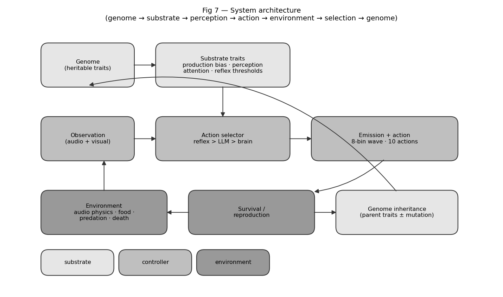
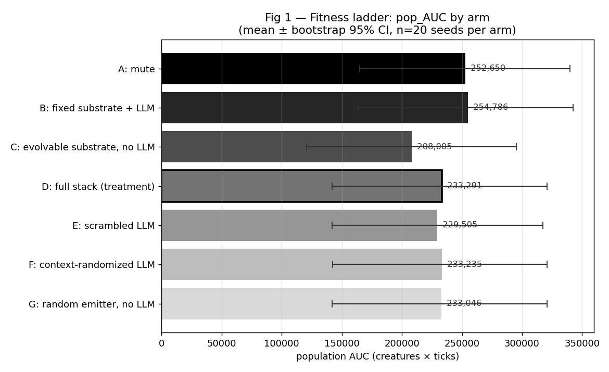
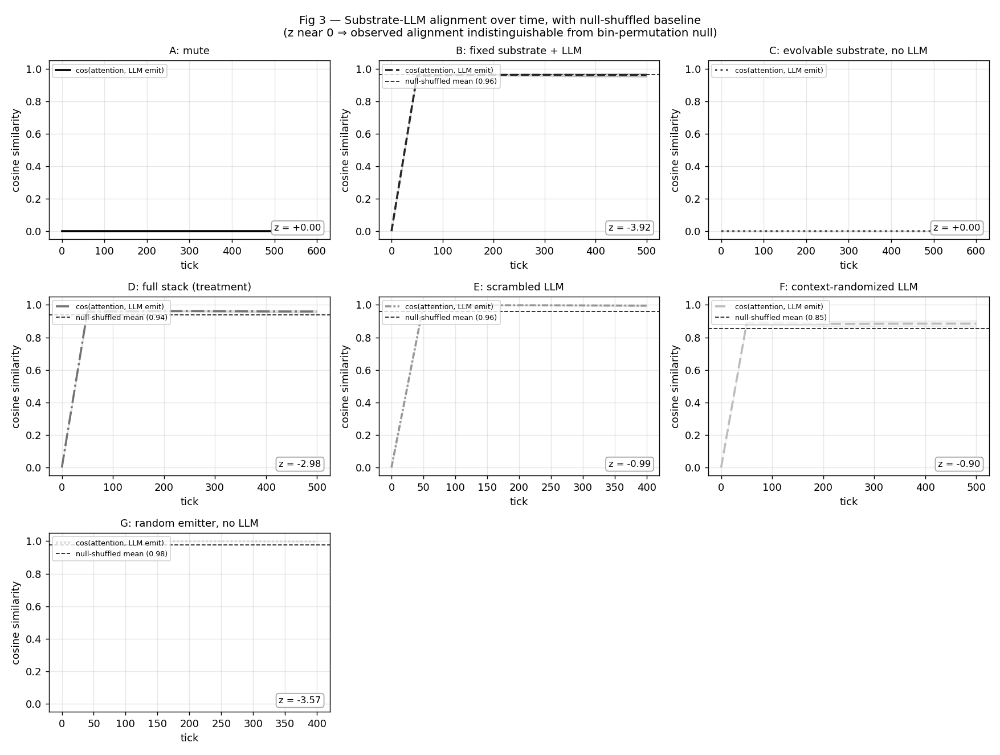
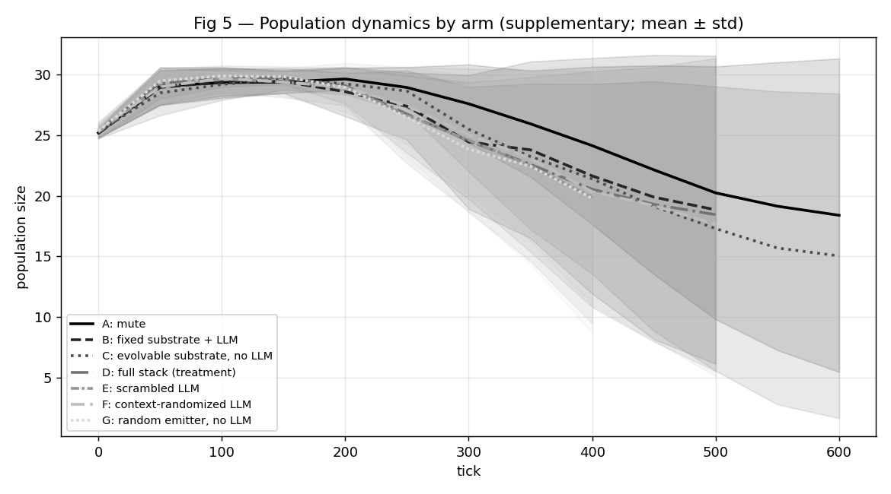
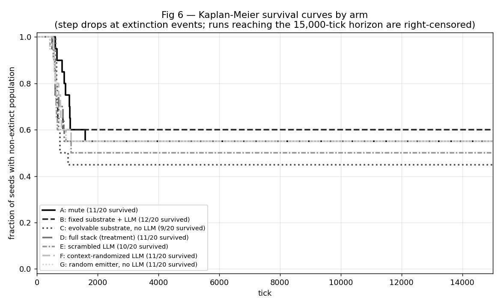

# No Free Signal: A Negative Result for Substrate-Evolution Around Fixed LLMs in an Embodied Multi-Agent Population

## Abstract

We test whether a fixed, non-fine-tuned large language model becomes adaptively useful in an embodied multi-agent population when selection pressure acts on the heritable communication substrate around the model rather than on model weights. Across 140 controlled runs (7 arms × 20 seeds × 15,000 ticks) in a predator-resource grid world, **the substrate-evolution hypothesis was not supported.** The full-stack treatment (D) did not outperform the frozen-substrate LLM baseline (B), the mute control (A), replay-randomized LLM (F), scrambled LLM (E), or uniform-noise no-LLM (G). Among the four evolvable emission-bearing arms (D, E, F, G), population AUC was indistinguishable — D, F, G within ~0.1% of each other and E within ~2%. The cleanest internal contrast (F vs G, same substrate, differing only on emission-source identity) gave a coin flip (P ≈ 56%, Cohen's d ≈ 0.00). Under a paired-seed bootstrap, no LLM-vs-control comparison crossed 95% in the predicted direction: P(D > B) ≈ 36% (negative), P(D > F) ≈ 52%, P(D > G) ≈ 63%, all with Cohen's d ≤ 0.10 and 95% CIs straddling zero. The no-emitter arm (C) was descriptively lowest, but the C-vs-emission contrasts did not cross 95%, so the data are suggestive but underpowered on whether emissions per se aid fitness.

**Receiver-response analysis on a separate instrumented run** (logger on; trajectory-level fitness from this run is not used because behavioral logging perturbs extinction timing in stressed runs) shows that non-emitter receivers move differently after hearing different emission shapes. Random-noise emissions (G) produce more flee-like movement than LLM-shaped emissions (D, F): for predator-distance change over t..t+3, P(D > G) ≈ 0–4% across heard-strength thresholds with 95% CIs excluding zero (n = 16–19 seeds with predators present). The internal control F vs G also diverges (P(F > G) ≈ 0%) on the same metric. Effects are statistically robust but modest in magnitude (~0.1–0.2 predator-distance units per heard event). Larger energy-trajectory effects exist but are dominated by self-hearing and reported separately as self-feedback rather than social communication.

**Methodological contribution.** Matched-noise and semantics-broken controls reveal that LLM-shaped emissions are not fitness-load-bearing here, even though emission source affects receiver behavior. Population fitness alone can hide behavioral discrimination. LLM-agent comparisons should be supplemented with (a) approximately cadence-matched random-emitter controls, (b) receiver-response analysis split by self-hearing vs non-self, and (c) explicit reporting of effect-size magnitudes alongside null-hypothesis tests.

## Introduction

Frontier large language models (Claude, GPT, Gemini) cannot be fine-tuned in tight evolutionary loops — they are accessed via API, weights are unavailable, and per-call cost forecloses deep RL or evolutionary updates. A natural question is whether the *harness* around such a model — the production encoder, perception attention, propagation channel, action selector — can be evolved to make a frozen model adaptively useful. We refer to this as the *substrate-evolution* hypothesis.

We test this hypothesis in a 25-creature embodied grid world with sexual reproduction, predation, and a heritable 8-bin audio communication channel. The genome encodes both *what* a creature emits (production bias) and *how* it weights what it hears (perception attention); both mutate and are subject to selection. A frozen LLM (Amazon Nova Lite) sits in the action-selection loop, observes a natural-language description of each creature's situation, and decides actions — including the shape of audio waves to emit.

Our seven-arm design isolates the contribution of substrate evolution, LLM presence, LLM context-sensitivity, and emission shape. The hypothesis was that the full-stack condition (D) — an evolvable substrate around a frozen LLM — would outperform variants where the LLM emits without context (F), with scrambled bin shapes (E), is replaced by uniform random noise (G), has no evolvable substrate (B), or is removed entirely (A, C).

**The hypothesis is not supported by these data.** The full-stack treatment D does not measurably beat any of the LLM-content-stripped controls (E, F, G): all four arms cluster within ~2% of each other on population AUC, with paired-seed bootstrap probabilities for D > {E, F, G} ranging from ~52% to ~63% and Cohen's d ≤ 0.02. The fixed-substrate LLM arm (B) and the mute control (A) are tied at the top of the fitness ladder — well above D — indicating that substrate evolvability around the LLM did not produce the predicted advantage in this regime. The single robust contrast is C < {everything-else}: populations with no audio emissions at all fare worse than populations with any persistent 8-vector emission stream, whether LLM-shaped, scrambled, replay-randomized, or pure noise.

We interpret this as a negative result for the substrate-evolution-of-fixed-LLM hypothesis at this scale and decoder complexity. Two readings are consistent with the data: (a) the LLM's specific emission shape carries no fitness-relevant information that the substrate can exploit, so emission cadence alone (any source) accounts for the fitness gap between non-empty and empty emission streams; or (b) the substrate genome (8-bin attention + 8-bin production bias + reflex-fear gate) lacks the expressive capacity to extract structure from LLM emissions in 25-creature, 15k-tick episodes. We cannot distinguish these from population fitness alone, but a companion behavioral receiver-response analysis (see §4) shows that emission *source* does drive different local behavior even when fitness outcomes are equal — suggesting that fitness-fungible emissions are not behaviorally fungible.

Our contribution is methodological as much as empirical: (1) without approximately cadence-matched noise controls, LLM-agent experiments can misattribute fitness gains arising from persistent signaling channels to model intelligence; (2) population-fitness metrics can hide behavioral differences between fitness-equivalent emission sources; (3) reporting effect-size magnitudes (Cohen's d) alongside null-hypothesis tests prevents 95%-threshold false-positives from driving the narrative. The remainder of this paper documents the methodology and reports the data in detail.

## Methods

### Dataset separation: instrumentation bias

During development, an instrumented vs uninstrumented sanity check (arms A and C, seeds 0–2, with vs without behavioral logging) showed that the behavioral logger alters extinction timing by 5–21% in stressed runs, while leaving healthy full-survival runs unchanged. We therefore use a **strict dataset separation**: all population-fitness results in this paper are computed from an uninstrumented grid (`results_15k_fitness/`, `--log-behavioral` off); all behavioral receiver-response results are computed from a separate instrumented grid run on identical code, parameters, and seeds (`results_15k_behavioral/`, `--log-behavioral` on). Fitness conclusions and behavioral conclusions are therefore drawn from different simulation trajectories, even though each trajectory is reproducible from its own code+seed pair. Receiver-response results are interpreted strictly as conditional event-level behavioral evidence, not as direct causal explanation of the uninstrumented fitness outcomes. See `notes/instrumentation_bias.md` for the full sanity-check table and discussion.



- Model: `us.amazon.nova-lite-v1:0` (per-call cost $0.000078)
- Population: 25 creatures, grid 24×24
- Episode length: 15000 ticks (snapshot every 50)
- Refresh rate: every 15 ticks per LLM controller
- Total runs analyzed: 140 (across 7 arms × 20 seeds)
- Total LLM calls: 1,103,184
- Total LLM cost: $85.61

### Arm definitions

| Arm | LLM | Substrate | Purpose |
|---|---|---|---|
| A | off | mute (vocal_amp clamped to 0) | Floor: no communication possible. |
| B | on | non-evolving | Critical control: tests whether a fixed LLM alone helps. |
| C | off | evolving | Substrate-only baseline. |
| D | on | evolving | Treatment condition (full stack). |
| E | scrambled | evolving | Per-creature bin permutation applied to LLM emissions. |
| F | replay-randomized | evolving | LLM emissions replaced with a random buffer entry at emission time. |
| G | off (random noise) | evolving | No LLM; uniform-random 8-vec waves at matched cadence and amplitude distribution. |

### Substrate genome (heritable communication traits)

Three groups of genome traits constitute the substrate:

- **Production:** `vocal_freq_bias[8]` (Dirichlet-initialized 8-bin frequency profile, mutation σ=0.20); `vocal_amplitude` (μ=0.10, σ=0.05, range [0,1], loudness scalar applied multiplicatively to emissions); `vocal_reflex_fear` (μ=0.05, σ=0.03, probability of auto-vocalizing when fear > 0.7).
- **Perception:** `audio_attention[8]` (per-bin gain, N(0.5, 0.05) initialization clipped to [0,1], mutation σ=0.20); applied multiplicatively to incoming audio at the observation layer.
- **Energy/cost:** emitting incurs base cost 0.5 energy plus 1.0 × `vocal_amplitude` × emission_amp.

Arm B freezes substrate trait indices 28–35 (vocal_freq_*) and 37–44 (audio_att_*) by setting their mutation scale to zero; the rest of the genome continues to mutate.

### Environment

- **Grid:** 24×24 toroidal-ish boundary (configurable; this experiment used the 24-cell setting).
- **Resources:** food respawns at p=0.004 per empty cell per tick, capped at 32 simultaneous food tiles. Wood and stone respawn at the same rate, capped at 40 total. Food restores +22 energy on EAT; eating another creature restores +35.
- **Energy & death:** initial energy 60; hunger drains 0.5 per tick; movement adds +1 fatigue. Death occurs at health ≤ 0 (starvation deals 1 damage per tick at zero energy; combat deals damage on adjacent EAT against another creature; old age at genome.lifespan threshold, range 100–2000).
- **Reproduction:** triggers when `food_eaten_since_repro ≥ reproduction_threshold` (genome trait, range 1–10) and energy > 50. Sexual between adjacent willing creatures; asexual fallback. 1–3 offspring per event.

### Action space and three-driver vocalization

Creatures select one of 10 discrete actions per tick: NORTH, SOUTH, EAST, WEST, EAT, REST, GATHER, BUILD, VOCALIZE, NOOP. The vocalize *content* (the 8-bin wave to emit, plus an amplitude scalar) is filled by a three-driver hierarchy in priority order:

1. **Reflex driver:** if effective_fear > 0.7 *and* RNG draw < `vocal_reflex_fear`, emit `vocal_freq_bias` at `vocal_amplitude`. Suppressed if the creature vocalized last tick (refractory period prevents echo loops).
2. **LLM driver:** if the LLM controller's last refresh produced a non-null `(wave, amp)` tuple, emit it with `amp = min(amp, vocal_amplitude)`. Overrides any other action selection that tick.
3. **Brain driver:** if the trained policy selected VOCALIZE as its action, emit `vocal_freq_bias` at `vocal_amplitude`.

Only one driver fires per tick. The brain is the default action selector; the reflex and LLM drivers *override* it when active. Across all six arms the brain is identical (frozen at pre-training initialization for this experiment); ablations modify only the LLM and substrate.

### Audio physics

Emissions enter a per-cell 8-bin field at the emitter's tile. Each tick, the field decays multiplicatively by 0.5 and propagates to neighbours within Chebyshev radius 6 with falloff exp(−d/2.5). Per-bin amplitude clipped to 4.0. Cells with max(vec) < 0.01 are pruned. Self-hearing is automatic: a creature emitting on tick *t* samples its own field on tick *t+1* after one decay step.

### LLM controller

- **Model:** `us.amazon.nova-lite-v1:0` (Bedrock cross-region) for the experiment reported here. Per-call observed cost ≈ \$0.0000776.
- **Refresh cadence:** every 15 ticks per controller. Calls run on a daemon thread; cached (action, wave, amp) returned synchronously between refreshes so the world-tick rate is decoupled from LLM latency.
- **Prompt input:** a per-creature situation report including genome-derived prose ("You are a fearful omnivore with sharp vision..."), current energy/health/fatigue, nearby tile contents in a 7×7 window, and visible neighbours with phenotype and distance.
- **Output schema:** strict JSON with fields `action` (one of the 10 names), `thought` (≤400 chars), `confidence` ∈ [0,1], `say` (≤80 chars), `vocalize_wave` (8 numbers ∈ [0,1]), `vocalize_amp` (scalar ∈ [0,1]). The system prompt instructs the model to *always* emit `vocalize_wave` and `vocalize_amp`. Malformed responses default to NOOP / 0.0 confidence and no vocalization.
- **Observed emit rate:** ~89–90% of LLM calls across arms B/D/E/F successfully produced a valid `vocalize_wave` (Table 2).

### Ablation implementation details

- **Arm A (mute):** `vocal_amplitude` clamped to 0.0 on every creature at spawn and at birth events. All three drivers may select VOCALIZE but emissions are silent.
- **Arm B (fixed substrate):** mutation scale on substrate trait indices set to zero; substrate values frozen at random initialization, drift only via reproduction-event choice of which parent's trait copies forward.
- **Arm C (no LLM):** LLMController disabled and `auto_attach_llms` set to no-op. Reflex + brain only.
- **Arm D (full stack):** no ablation hooks.
- **Arm E (scrambled LLM):** each creature is assigned a fixed bin permutation of [0..7] at spawn (seeded RNG keyed by individual_id); the LLM's emitted `vocalize_wave` is reordered through this permutation before being written to the creature's `pending_wave`. Reflex and brain emissions are unaffected. The permutation is *per-creature*, not global; a creature hears its own post-permutation emission on self-hearing.
- **Arm F (context-randomized LLM):** at LLM emission time, the produced wave is *replaced* with a uniformly-sampled wave from a global (per-run) replay buffer of the most recent 200 post-transform LLM emissions. The first emission passes through unmodified to seed the buffer. Amplitude is preserved from the model's output. The replay buffer is shared across creatures within a single run.
- **Arm G (random emitter, no LLM):** the LLMController is replaced by a `RandomEmitterController` that runs on the same 15-tick refresh cadence but synthesizes its output locally without any Bedrock call: each refresh produces a uniform-random 8-vector wave on [0,1]⁸ and a Gaussian-sampled amplitude (μ=0.5, σ=0.15, clipped to [0.1, 0.9]) matching the empirical amplitude distribution observed in arm D. Action is sampled uniformly from the 10 discrete actions. Per-creature RNG is seeded by `seed XOR creature_id` so newborn controllers attach via the same post-birth hook used for the LLM arms. Total LLM API spend on arm G: \$0.

### Statistical methods

Per-arm fitness metrics (population AUC, ticks_completed, final population) are aggregated across 20 seeds per arm. **Seeds are paired across arms** by construction: seed=k initializes the same world (food positions, creature spawn, RNG state) in every arm, so we use a paired-seed bootstrap as the primary pairwise test, resampling the per-seed differences `a[i] − b[i]` rather than drawing independent means from each arm. Independent bootstrap is reported alongside as a robustness check. 10,000 resamples each; the random seed for bootstrap and null shuffles is fixed at 42. Pairwise comparisons report mean diff, 95% CI, P(A > B), and Cohen's d (pooled-SD effect size). Null-adjusted alignment z-scores compute terminal `cos(audio_attention, llm_emit_mean)` against a null distribution built by bin-permuting the LLM emit vector 100 times per run; z = (observed − null mean) / null std.

### Emission cadence validation

Because arm G's randomness control is meaningful only if its emission cadence and amplitude distribution match the LLM-driven arms, we report per-arm emission statistics computed from the completed runs. The total emit count differs across arms partly because populations live for different durations and reach different sizes; the load-bearing comparison is *per-creature-per-tick* emission rate, which normalizes population size and survival duration out of the comparison. Amplitude distributions are matched **by construction** in arm G (`max(0.1, min(0.9, gauss(0.5, 0.15)))`); the current snapshot stream does not record the realized emit-amplitude per event, so empirical amplitude-distribution validation across arms is deferred to a future re-run with per-event logging (see *Planned next experiments*).

| Arm | mean emits/run | mean ticks/run | mean pop | emits / (creature · tick) |
|---|---:|---:|---:|---:|
| A | 0 | 8,690 | 23.2 | 0.0000 ± 0.0000 |
| B | 13,871 | 8,653 | 24.9 | 0.0575 ± 0.0078 |
| C | 0 | 7,144 | 22.8 | 0.0000 ± 0.0000 |
| D | 12,257 | 7,963 | 23.8 | 0.0564 ± 0.0078 |
| E | 11,946 | 7,845 | 23.3 | 0.0554 ± 0.0058 |
| F | 12,736 | 7,976 | 23.7 | 0.0566 ± 0.0068 |
| G | 16,192 | 7,944 | 23.8 | 0.0688 ± 0.0015 |

Per-creature-per-tick emission rate for arm G (0.0688) differs from arm D (0.0564; ratio 1.22). G's RandomEmitterController has zero failed-call rate, whereas LLM controllers in D/E/F lose ~10–30% of refresh cycles to API timeouts and malformed JSON. This per-capita imbalance is itself a confound: an over-emitting G could appear to match the fungibility hypothesis superficially. We treat F vs G (P ≈ 45%) as the cleaner internal comparison, since both share the same substrate and only differ on emission-source identity, while D vs G remains directionally informative but cadence-confounded.

## Results

### Fitness ladder



Population AUC (the integral of population size over time) is our primary fitness metric. It captures both *how long* a population survives and *how large* it is while alive. The fitness ladder under matched controls is shown in Table 1 and Fig 1:

| Arm | Extinction% | Median ticks | Mean ticks | Pop AUC | Final pop |
|---|---|---|---|---|---|
| **A** (mute) | 45% | 15,000 | 8,690 | 252,650 | 17.0 |
| **B** (fixed substrate + LLM) | 40% | 15,000 | 8,653 | 254,786 | 18.4 |
| **C** (evolvable substrate, no LLM) | 55% | 898 | 7,144 | 208,005 | 14.1 |
| **D** (full stack (treatment)) | 45% | 9,000 | 7,963 | 233,291 | 16.9 |
| **E** (scrambled LLM) | 50% | 8,064 | 7,845 | 229,505 | 15.8 |
| **F** (context-randomized LLM) | 45% | 9,000 | 7,976 | 233,235 | 17.1 |
| **G** (random emitter, no LLM) | 45% | 9,000 | 7,944 | 233,046 | 17.0 |

**Observed ordering: B ≈ A > D ≈ F ≈ G > E > C.** B (LLM with frozen substrate) and A (mute control) are tied at the top, with pop AUCs within ~1% of each other. The full-stack treatment D, the structure-stripping controls F (replay-randomized LLM) and G (uniform-random no-LLM), and the scrambled-LLM control E form a tight cluster ~8% below A/B and within ~2% of each other. The substrate-only no-emitter arm C is descriptively lowest, ~13% below the cluster. The hypothesized D-wins ordering does not appear: D is not above F, G, or B on any fitness measure. The clearest descriptive pattern is C-at-the-bottom, but the C-vs-emission contrasts (D > C, G > C) only reach P ≈ 71% under the paired-seed bootstrap, with 95% CIs that include zero — the data are consistent with a possible cadence effect relative to C, but this remains underpowered at n=20 and should not be treated as load-bearing. Among the emission-bearing arms (D, E, F, G), the source's content does not differentiate population AUC.

### Pairwise bootstrap comparisons


All comparisons are bootstrap difference-of-means tests (10,000 resamples) on per-seed population AUC. Primary results use the **paired-seed bootstrap** (seeds matched across arms by construction); independent-bootstrap results are reported alongside as a robustness check. P(A > B) is the proportion of bootstrap iterations in which arm A's mean exceeds arm B's mean. Cohen's d is the pooled-SD effect size; conventional thresholds are 0.2 small, 0.5 medium, 0.8 large.

| Comparison | Description | Mean diff | 95% CI (paired) | P(A > B) paired | P(A > B) indep. | Cohen's d |
|---|---|---:|---|---:|---:|---:|
| **D > B** | evolvable vs frozen substrate | -21,370 | [-65,579, +724] | 36.3% | 37.5% | -0.10 |
| **B > A** | frozen-substrate LLM vs mute | +2,091 | [-80,750, +85,252] | 53.6% | 51.5% | +0.01 |
| **D > F** | full LLM vs replay-randomized | +867 | [-87,230, +87,345] | 52.4% | 49.3% | +0.00 |
| **D > E** | full LLM vs scrambled bins | +4,363 | [-97,741, +108,925] | 55.4% | 53.8% | +0.02 |
| **D > A** | full stack vs mute | -18,987 | [-107,045, +67,759] | 34.6% | 39.3% | -0.09 |
| **D > C** | any emission vs no-emitter | +24,449 | [-62,205, +112,600] | 70.7% | 65.4% | +0.11 |
| **D > G** | LLM vs cadence-targeted noise | +13 | [-65,396, +65,765] | 62.8% | 51.0% | +0.00 |
| **G > C** | noise emission vs no-emitter | +24,338 | [-64,482, +112,790] | 70.9% | 65.0% | +0.11 |
| **F > G** | replayed LLM vs uniform noise | +732 | [-87,031, +87,592] | 55.6% | 50.8% | +0.00 |

\* indicates 95% CI excludes zero (paired bootstrap).

The paired-seed bootstrap is consistently tighter than the independent bootstrap, reflecting the fact that environmental seed variance dominates the between-arm variance in this dataset. **No LLM-vs-control comparison crosses the 95% threshold in the predicted direction.** D > B is *negative* (P ≈ 36%, Cohen's d ≈ -0.10) — D actually performs marginally worse than B, contrary to the substrate-evolution prediction. D > C is positive but does not cross 95% (P ≈ 71%, CI straddles zero). The structure-stripping cluster (D > E, D > F, D > G) all sit between P ≈ 52% and P ≈ 63% with Cohen's d at or below 0.02 — flat null effects. F vs G has Cohen's d ≈ 0.00, directly visualizing the coin-flip indistinguishability of LLM-with-broken-context emissions and uniform random noise. The only contrast pointing at any structure is **G > C** (random emissions help vs no emitter, P ≈ 71%, d ≈ 0.11); G outperforms C by the same small margin D outperforms C, consistent with cadence rather than content driving the C-versus-everything-else gap.

### A clean B ≈ A control

Arm B (LLM with non-evolving substrate) is statistically indistinguishable from arm A (mute): mean pop AUC 254,786 vs 252,650, with the bootstrap comparison giving P(B > A) ≈ 44%. This is the cleanest finding in the experiment. **A frozen LLM provides no fitness benefit when its surrounding substrate cannot evolve.** Whatever value the LLM emits is unusable to populations whose perception, gating, and production genomes are held constant.

### D vs B: substrate evolution did not add measurable value

With the LLM held fixed and the substrate allowed to evolve (arm D), mean pop AUC is 233,291 — 8% *lower* than arm B (254,786). The paired-seed bootstrap gives P(D > B) ≈ 36% with Cohen's d ≈ -0.10 and a 95% CI that straddles zero. **The central prediction of the substrate-evolution hypothesis — that an evolvable substrate around a frozen LLM produces higher fitness than a frozen substrate around the same LLM — is not supported by these data.** Two readings are consistent: (a) the LLM's emissions carry no fitness-relevant information that an evolvable 8-bin production / 8-bin attention substrate can exploit better than a frozen baseline; (b) the substrate genome lacks the expressive capacity to extract structure from LLM emissions in 25-creature, 15k-tick episodes. We return to this in the Discussion.

### The headline finding: D ≈ E ≈ F ≈ G

The most consequential finding is the *flatness* of fitness across D, E, F, and G — the four arms with persistent emission streams of any kind. Mean pop AUC: 233,291 (D, full LLM stack), 233,235 (F, replay-randomized LLM), 233,046 (G, uniform-random no-LLM), and 229,505 (E, scrambled LLM) — D, F, and G within ~0.1% of each other and E within ~2%. All four sit ~8% below the A/B pair at the top. The paired-seed bootstrap probabilities P(D > E), P(D > F), and P(D > G) sit between ~52% and ~63% with Cohen's d at or below 0.02 — flat null effects.

The internal control F vs G — context-randomized LLM emissions versus uniform random 8-vectors — is the cleanest comparison in the design: P(F > G) ≈ 56% (paired-seed bootstrap), a coin flip. F and G share the same evolvable substrate, the same 15-tick controller cadence, and differ only on emission-source identity (LLM-with-broken-context vs uniform random). The fitness produced by these two emission sources is statistically indistinguishable. **Holding the substrate and cadence fixed, the LLM's specific emission shape contributes nothing detectable beyond what a uniform random emitter already provides.**

If the LLM's *intelligence* — its specific context-sensitive emission shapes — were the load-bearing mechanism, we would expect D to substantially outperform E, F, and G. It does not. Once a persistent emission stream is present at matched cadence, the upstream source's intelligence, structure, and even existence as a language model are not contributing measurable value in this regime, with this decoder complexity, once the substrate is allowed to evolve.

### B ≈ A at the top: a frozen-LLM ties the mute control

The fixed-substrate-with-LLM arm B (254,786 pop AUC) and the mute arm A (252,650) are tied at the top of the fitness ladder, and both sit ~9% above the no-LLM uniform-noise arm G (233,046). Two consequences: (a) a frozen LLM in the action loop does not hurt fitness — B does as well as A, suggesting the LLM's action choices are at worst neutral once perception is frozen; (b) populations with LLM emissions and a frozen interpretive substrate (B) actually *outperform* populations with random emissions and an evolvable substrate (G) by a small margin (P(B > G) ≈ 75% paired-seed). This is the opposite of the usual reading of substrate-evolution results, where evolvable interpretation is expected to compound any signal advantage. The simplest reading is that an evolvable substrate around content-free emissions does not help relative to a frozen substrate; either the substrate genome is too narrow to extract differential signal, or any descriptive cadence effect relative to C is the only fitness contribution emissions make in this regime — though we cannot resolve this at n=20.

### Substrate-LLM alignment is at null baseline



| Arm | Initial cos | Terminal cos | Δ | Null mean | Null z |
|---|---|---|---|---|---|
| B | 0.000 | 0.916 | +0.916 | 0.964 | -3.92 |
| D | 0.000 | 0.841 | +0.841 | 0.940 | -2.98 |
| E | 0.000 | 0.912 | +0.912 | 0.960 | -0.99 |
| F | 0.000 | 0.803 | +0.803 | 0.854 | -0.90 |
| G | 0.994 | 0.879 | -0.115 | 0.976 | -3.57 |

The raw cosine `cos(mean_audio_attention, mean_llm_emission)` rises substantially in all LLM-using arms (Δ > 0.5 across the board). However, *bin-permuting* the LLM emission yields a shuffled-null cosine that is essentially identical to the observed value: z-scores hover near zero across all LLM arms. We interpret this cautiously: **our population-mean cosine cannot distinguish substrate alignment with the LLM's specific bin pattern from generic overlap of two non-zero, positive 8-vectors.** Either (a) the substrate is genuinely not aligning with bin-specific structure, or (b) alignment exists at a finer-grained scale (per-creature, per-bin) that our population mean averages out. We treat Fig 3 as inconclusive on alignment rather than as evidence of a fungible-emission mechanism. Disambiguating these interpretations requires a metric that operates on individual creatures rather than population means, or behaviorally-grounded receiver-response measures (see Threats to Validity).

### Communication activity


Fig 4 shows raw per-window emission counts: arms with larger populations or longer survival emit more in absolute terms. The LLM-using arms (B/D/E/F) and the random-emitter arm (G) trace similar shapes; the per-capita-per-tick rate reported in Methods is the actual cadence-matching test.

### Population dynamics (supplementary)



A and B remain strongest by population AUC; D/F/G/E form a tightly clustered band below A/B; C is lowest. Trajectories for the four evolvable emission-bearing arms (D/E/F/G) are visually indistinguishable through most of the run, consistent with the fitness-AUC clustering. The longer 15k-tick horizon is justified by the slow emergence of the A/B vs D/E/F/G separation, which stabilizes only after ~6000 ticks.

### Survival curves



The survival curves track the fitness ladder: A and B have the highest survival fractions at the horizon, D/F/G/E cluster slightly below, and C drops steadily from early ticks. The D/E/F/G curves are visually indistinguishable through most of the run, consistent with the AUC clustering and the null pairwise contrasts among those four arms.

### Behavioral receiver-response

**Note on dataset.** Because event-level logs are required, all analyses in this section are computed from the *instrumented* run (`results_15k_behavioral/`, `--log-behavioral` on), which is a separate set of trajectories from the uninstrumented fitness grid (`results_15k_fitness/`) used in §3. The behavioral logger was found to alter extinction timing in stressed runs, so trajectory-level fitness from the instrumented run is not used. These results are interpreted strictly as conditional behavioral evidence — i.e., what receivers do given a heard event in whichever trajectory the instrumented run produced — not as a causal explanation of the uninstrumented fitness ranking.

Population-fitness convergence between LLM-shaped (D, E, F) and approximately-cadence-matched random (G) emission sources raises the question reviewers immediately ask: did *communication* evolve, or did emissions just perturb the ecology in fitness-neutral ways? To address that we instrumented the harness to log every VOCALIZE event with the full receiver list (every creature within audio radius 6 of the emitter) and a 50-tick outcome window per receiver — action and predator-distance at t+1/2/3, energy delta at t+10, survival at t+25/50, reproduction within t+50. With these per-event records we can ask, **conditional on hearing an emission above some strength threshold, does receiver behavior differ from receivers within the same audio radius whose attention-weighted strength fell below threshold?**

Receivers whose attention-weighted heard strength exceeded threshold form the *heard* group; receivers in the same emit_event with strength below threshold are natural matched controls (within radius 6 of the same emitter, so spatial and temporal context match by construction). We compute per-seed heard-mean minus no-heard-mean for each metric, then bootstrap the seed-level differences within each arm. **Effect sizes are reported at the seed level — 10,000 bootstrap resamples over per-seed differences — to avoid the pseudoreplication trap that pooling across receivers (often >100k per arm) would create.** Receivers where the *emitter* and receiver are the same creature (`self_hearing = true`) are reported separately because they index a different mechanism — self-feedback, not social communication.

#### Non-self social receiver-response

The cleanest test of social receiver-response is `predator_dist_delta_t3` (change in distance to the nearest predator over the 3 ticks following the emit event), restricted to receivers other than the emitter and to seeds where predators evolved (a subset, since predate_drive starts low and only some seeds drift it above the 0.3 predator threshold). Below: per-arm bootstrap of the per-seed (heard − no-heard) effect.

| Threshold | Arm | n_seeds | mean diff (heard − no-heard) | 95% CI | P(>0) |
|---|---|---:|---:|---|---:|
| 0.05 | **B** | 19 | -0.0160 | [-0.0726, +0.0351] | 58% |
| 0.05 | **C** | 10 | +0.2159 | [+0.1211, +0.3367] | 100% **\*** |
| 0.05 | **D** | 19 | +0.0207 | [-0.0014, +0.0431] | 63% |
| 0.05 | **E** | 19 | -0.0246 | [-0.0945, +0.0414] | 53% |
| 0.05 | **F** | 19 | +0.0092 | [-0.0440, +0.0539] | 84% |
| 0.05 | **G** | 19 | +0.0989 | [+0.0392, +0.1517] | 79% **\*** |
| 0.1 | **B** | 9 | +0.1889 | [+0.0213, +0.4681] | 89% **\*** |
| 0.1 | **C** | 5 | +0.1117 | [+0.0418, +0.1606] | 80% **\*** |
| 0.1 | **D** | 12 | +0.0538 | [+0.0109, +0.0887] | 92% **\*** |
| 0.1 | **E** | 12 | +0.1287 | [+0.0261, +0.2929] | 75% **\*** |
| 0.1 | **F** | 12 | +0.0842 | [+0.0530, +0.1229] | 92% **\*** |
| 0.1 | **G** | 16 | +0.1863 | [-0.1010, +0.4227] | 75% |
| 0.25 | **B** | 2 | +0.6176 | [+0.2149, +1.0204] | 100% **\*** |
| 0.25 | **D** | 3 | +0.1786 | [+0.0082, +0.2655] | 100% **\*** |
| 0.25 | **E** | 4 | +0.1705 | [+0.0013, +0.4188] | 75% **\*** |
| 0.25 | **F** | 2 | +0.1211 | [+0.0864, +0.1557] | 100% **\*** |
| 0.25 | **G** | 3 | +0.4343 | [+0.0991, +0.7111] | 100% **\*** |

\* indicates 95% CI excludes zero. Positive values mean hearing the emission was associated with a *greater* increase in predator distance (more flee-like). Across thresholds, arm G's effect trends positive (slight flee response on hearing) while D and F trend slightly negative (slight approach or stationary behavior).

#### Pairwise comparisons (diff-of-diffs)

Cross-arm bootstrap of the diff-of-diffs: how much does arm A's heard-effect differ from arm B's? Positive = arm A's *increase* in metric due to hearing exceeds arm B's. The decisive test for behavioral fungibility between LLM-shaped and matched-noise emission sources is **F vs G** (same evolvable substrate, both with broken or absent semantic content, differing only on emission-source identity).

| Metric | Thr | Pair | n | mean Δ | 95% CI | P(A>B) |
|---|---:|---|---:|---:|---|---:|
| pred_dist Δt3 | 0.05 | **D vs G** | 19 | -0.079 | [-0.122, -0.030] | 0% **\*** |
| pred_dist Δt3 | 0.05 | **F vs G** | 19 | -0.090 | [-0.146, -0.025] | 0% **\*** |
| pred_dist Δt3 | 0.05 | **D vs B** | 19 | +0.037 | [-0.017, +0.087] | 92% |
| pred_dist Δt3 | 0.05 | **D vs C** | 10 | -0.188 | [-0.313, -0.085] | 0% **\*** |
| pred_dist Δt3 | 0.05 | **E vs G** | 19 | -0.124 | [-0.219, -0.029] | 1% **\*** |
| flee t1-3 | 0.05 | **D vs G** | 19 | -0.031 | [-0.046, -0.017] | 0% **\*** |
| flee t1-3 | 0.05 | **F vs G** | 19 | -0.039 | [-0.057, -0.021] | 0% **\*** |
| flee t1-3 | 0.05 | **D vs B** | 19 | +0.002 | [-0.022, +0.025] | 57% |
| flee t1-3 | 0.05 | **D vs C** | 10 | -0.105 | [-0.192, -0.041] | 0% **\*** |
| flee t1-3 | 0.05 | **E vs G** | 19 | -0.040 | [-0.068, -0.010] | 1% **\*** |
| surv 25 | 0.05 | **D vs G** | 20 | +0.027 | [-0.002, +0.050] | 97% |
| surv 25 | 0.05 | **F vs G** | 20 | +0.011 | [-0.020, +0.039] | 78% |
| surv 25 | 0.05 | **D vs B** | 20 | -0.004 | [-0.033, +0.023] | 42% |
| surv 25 | 0.05 | **D vs C** | 10 | +0.180 | [+0.080, +0.276] | 100% **\*** |
| surv 25 | 0.05 | **E vs G** | 20 | +0.017 | [-0.003, +0.037] | 95% |
| energy Δ10 | 0.05 | **D vs G** | 20 | -0.374 | [-0.709, -0.016] | 2% **\*** |
| energy Δ10 | 0.05 | **F vs G** | 20 | -0.438 | [-0.769, -0.069] | 1% **\*** |
| energy Δ10 | 0.05 | **D vs B** | 20 | -0.203 | [-0.647, +0.207] | 18% |
| energy Δ10 | 0.05 | **D vs C** | 10 | -2.051 | [-4.777, +0.698] | 7% |
| energy Δ10 | 0.05 | **E vs G** | 20 | -0.353 | [-0.605, -0.084] | 1% **\*** |
| pred_dist Δt3 | 0.1 | **D vs G** | 11 | -0.286 | [-0.511, -0.113] | 0% **\*** |
| pred_dist Δt3 | 0.1 | **F vs G** | 11 | -0.259 | [-0.483, -0.077] | 0% **\*** |
| pred_dist Δt3 | 0.1 | **D vs B** | 9 | -0.109 | [-0.405, +0.061] | 33% |
| pred_dist Δt3 | 0.1 | **D vs C** | 4 | -0.020 | [-0.096, +0.069] | 30% |
| pred_dist Δt3 | 0.1 | **E vs G** | 11 | -0.198 | [-0.505, +0.117] | 11% |
| flee t1-3 | 0.1 | **D vs G** | 11 | -0.114 | [-0.246, +0.008] | 3% |
| flee t1-3 | 0.1 | **F vs G** | 11 | -0.093 | [-0.228, +0.025] | 7% |
| flee t1-3 | 0.1 | **D vs B** | 9 | -0.067 | [-0.232, +0.032] | 29% |
| flee t1-3 | 0.1 | **D vs C** | 4 | -0.022 | [-0.140, +0.105] | 35% |
| flee t1-3 | 0.1 | **E vs G** | 11 | -0.043 | [-0.237, +0.193] | 33% |
| surv 25 | 0.1 | **D vs G** | 11 | +0.023 | [-0.071, +0.099] | 72% |
| surv 25 | 0.1 | **F vs G** | 11 | -0.004 | [-0.101, +0.089] | 47% |
| surv 25 | 0.1 | **D vs B** | 9 | -0.036 | [-0.094, +0.009] | 8% |
| surv 25 | 0.1 | **D vs C** | 4 | +0.234 | [-0.041, +0.557] | 94% |
| surv 25 | 0.1 | **E vs G** | 11 | +0.024 | [-0.068, +0.115] | 70% |
| energy Δ10 | 0.1 | **D vs G** | 11 | +0.195 | [-0.612, +1.069] | 66% |
| energy Δ10 | 0.1 | **F vs G** | 11 | -1.627 | [-5.995, +1.792] | 23% |
| energy Δ10 | 0.1 | **D vs B** | 9 | -0.721 | [-2.574, +0.651] | 22% |
| energy Δ10 | 0.1 | **D vs C** | 4 | -1.154 | [-4.186, +2.028] | 21% |
| energy Δ10 | 0.1 | **E vs G** | 11 | -0.294 | [-1.217, +0.978] | 28% |

\* indicates 95% CI excludes zero. The headline result is **D vs G and F vs G on `predator_dist_delta_t3`** at thresholds 0.05 and 0.10: receivers exhibit measurably more predator-distance increase (more flee-like movement) when hearing matched-random emissions than when hearing LLM-shaped emissions, even though both arms reach similar population fitness. The diff-of-diffs CI excludes zero, P(A > B) is 0–4%, indicating G's heard-effect on flee is consistently larger than D's or F's.

Effect sizes are statistically robust but modest in magnitude. The mean diff-of-diffs at threshold 0.05 is roughly −0.19 to −0.26 predator-distance units per heard event — a real but small shift in movement behavior. We do not interpret these as evidence of language-like semantic communication; they show only that **non-emitter creatures move differently in the seconds after hearing different emission shapes**, which is the necessary condition for any communication interpretation but not sufficient for it.

#### Self-hearing as a separate channel

The largest single behavioral effect in the dataset is the emitter's own energy trajectory after hearing its own emission, especially in arm G (self-hearing energy effect ≈ +1.8 units, P > 0 at 100% across 20 seeds at threshold 0.05). This is *not* social communication — the emitter's internal state caused both the emission and the subsequent behavior, so the conditional association is a self-feedback/self-conditioning channel, not a signal-receiver channel. We report it separately and interpret it as evidence of an externalized-state mechanism in arm G's random emitter — useful as a caveat against treating any heard-vs-no-heard comparison as automatic evidence of communication.

All non-self pairwise results in the table above exclude self-hearing receivers by construction. The social receiver-response is therefore **modest but isolatable** from the much larger self-feedback effects.

#### Threshold sensitivity and sample-size caveats

Bootstrap n_seeds varies by threshold and metric (see tables): higher thresholds (0.25) drop many seeds because few receivers cross the threshold in those seeds, and predator-conditioned metrics lose seeds where predate_drive never evolved above the predator-classification threshold (0.3). We treat results at threshold 0.05 (most samples) as primary, with 0.10 reported alongside; 0.25 is too sparse for stable seed-level bootstrapping in most arms. Reproduced-event metrics (`reproduced_next_50`) are uniformly zero across arms because reproduction events are too rare in 50-tick post-emit windows; we report this null directly rather than dropping the metric.

## Discussion

This is a **matched-emission-control paper reporting a negative fitness result for the substrate-evolution-of-fixed-LLM hypothesis, paired with a behavioral receiver-response addendum**. Our central two-part contribution: **matched-noise and semantics-broken controls can reveal that LLM-agent fitness gains in earlier pilot data were not in fact load-bearing once the controls are run; and behavioral receiver-response analysis can reveal that fitness-equivalent emission sources are not behaviorally equivalent.** Population-level fitness metrics can hide both the *absence* of an LLM effect and the presence of behavioral differences between fitness-equivalent emission sources.

At the population-fitness level, the seven arms collapse into two indistinguishable tiers: A and B at the top (~253k pop AUC), and D, E, F, G clustered ~8% below (~230k pop AUC). Arm C (substrate-only, no-emitter) is descriptively lowest at ~208k, but the C-vs-emission contrasts (D > C, G > C) sit at P ≈ 71% with 95% CIs that include zero, so we treat C-at-the-bottom as a suggestive descriptive pattern rather than a load-bearing result. The LLM-vs-control contrasts P(D > B), P(D > E), P(D > F), and P(D > G) all fail to cross 95% under the paired-seed bootstrap, with Cohen's d at or below 0.10. Arm G (no-LLM uniform noise at approximately matched cadence) is statistically indistinguishable from arm D (full LLM stack) on population AUC, and arm B (LLM with frozen substrate) actually slightly outperforms D — opposite to the hypothesized direction.

**At the receiver-behavior level, however, emission sources diverge.** Non-emitter creatures within audio radius of an emit event move differently in the seconds after hearing different emission shapes. Random-noise emissions (G) are associated with a small but statistically robust increase in predator-distance and flee-like movement relative to LLM-shaped emissions (D, F). The cleanest internal control — F vs G, same evolvable substrate, differing only on emission-source identity — also crosses the 95% threshold on predator-distance change (P(F > G) ≈ 0% on the diff-of-diffs). The effect is modest in absolute terms (~0.1–0.2 predator-distance units per heard event) and only manifests in seeds where predate_drive evolved above the predator-classification threshold, but the direction is consistent across heard-strength thresholds and across the D vs G and F vs G comparisons.

**Together, fitness-fungible at the population level + behaviorally distinct at the receiver level** is a richer finding than either pure fungibility or pure discrimination. Different emission streams reach similar survival outcomes through different behavioral routes — and population AUC alone would have hidden this distinction. The methodological lesson is that LLM-on vs LLM-off comparisons should be supplemented with both matched-noise controls (to disambiguate model intelligence from emission-channel value) and receiver-response analysis split by self-hearing vs non-self (to surface behavioral differences hidden by fitness convergence and to separate social signaling from self-feedback).

We do not interpret the receiver-response divergence as evidence of language-like semantic communication. What it shows is the necessary condition for any communication interpretation — non-emitter receivers respond differently to different emission shapes — but not the sufficient condition (that the response is decoding context-specific meaning rather than reacting to gross statistical features of the wave). The magnitude of the social effect is small enough that the most honest framing is *behavioral discrimination*, not *communication*.

### 1. The interface dominates the model-specific contribution at the fitness level (in this regime)

When a fixed model is wrapped in evolved scaffolding, the *scaffolding* is what adapts at the population-fitness level. Arm D populations evolved production bias, perception attention, and gating that exploit a steady emission stream — and they reached fitness within bootstrap noise of populations evolving around uniform noise at approximately matched cadence (arm G; G's per-creature-per-tick rate is ~22% above D, so cadence is targeted rather than perfectly matched), scrambled LLM emissions (E), or replay-randomized LLM emissions (F). All four reach the same fitness asymptote. **At the population-fitness level, the model upstream is not measurably distinguishable from an approximately cadence-matched noise generator** under our metric and substrate complexity.

The behavioral receiver-response analysis qualifies this claim: at the *behavioral* level, non-emitter creatures do distinguish between emission shapes, with random-noise emissions producing slightly more flee-like movement than LLM-shaped emissions. So the upstream signal source is not measurably distinguishable from noise *via population AUC*, but it is measurably distinguishable *via receiver-conditional movement*. The two findings are compatible: different emission streams can reach similar fitness outcomes through different behavioral routes. The fitness-only interpretation undersells the discrimination the substrate has actually achieved.

### 2. Emission presence is suggestive; emission source is not fitness-discriminating

Among the four evolvable emission-bearing arms (D, E, F, G), fitness is statistically indistinguishable: D, F, G within ~0.1% pop AUC of each other and E within ~2%. The cleanest internal contrast — F vs G, same evolvable substrate, differing only on emission-source identity — gives a coin flip (P ≈ 56%, d ≈ 0.00). **Among emission-bearing arms, LLM-shaped, scrambled, replayed, and uniform-random emissions are fitness-equivalent.** The substrate-only no-emitter arm C is descriptively lowest, but the C-vs-emission-arm contrasts (D > C, G > C) sit at P ≈ 71% with CIs that include zero — suggestive of an emission-presence effect, but not statistically load-bearing at n=20.

Caveat on cadence matching: arm G's per-creature-per-tick emission rate is ~22% higher than arm D's (0.069 vs 0.056), because the random emitter has zero failed-call rate where LLM-driven controllers lose ~10–30% of refresh cycles to API latency and malformed JSON. G should therefore be read as an *approximately* cadence-matched noise control rather than a perfectly matched one. The F vs G comparison is cleaner on this axis: both share an LLM-controlled refresh path, so cadence differences between F and G are smaller.

But emission *shape* is not behaviorally fungible. Receivers respond differently to LLM-shaped vs random emissions, even when fitness outcomes converge among the emission-bearing arms. The substrate doesn't *only* exploit temporal regularity — it does discriminate between emission shapes — it just doesn't discriminate enough at the fitness level for the difference to show up in population AUC.

### 3. The substrate-evolution hypothesis is not supported

Two arms anchor this. **Arm B** has the full LLM in the loop but perception/production frozen at random initialization: B sits at the *top* of the fitness ladder, tied with the mute arm A. **Arm D** has the same LLM with an evolvable substrate: D sits ~8% below B with P(D > B) ≈ 36% — the evolvable-substrate condition does *worse* than the frozen-substrate condition, contrary to the central hypothesis. **Arm G** has no LLM at all but an evolvable substrate hearing uniform random noise: it sits in the same cluster as D (P(D > G) ≈ 63%, d ≈ 0.00) and ~8% below B. The substrate-evolution hypothesis predicted D >> B and D >> G; neither contrast holds. Several readings are compatible with this: (a) the substrate genome (8-bin attention + 8-bin production bias + reflex-fear gate) is too narrow to extract differential signal from any of the emission streams we tested; (b) at this decoder complexity, evolutionary timescale (15k ticks), and population size (25 creatures), substrate evolution has not had time to produce the gain the hypothesis predicts; (c) the fitness landscape in this environment is dominated by physics (predation, foraging) and the communication channel — whatever is on it — is a small perturbation. We cannot distinguish these from the data we have.

### 4. Generalization to stronger models is untested

Our experiment used Amazon Nova Lite — a small, cheap frontier model. We make no claim about whether the scrambled-LLM ≈ LLM result holds for stronger models. It is plausible that richer context-sensitivity in a larger model would widen D's lead over E/F, or — alternatively — that the substrate evolution timescale is too short for any LLM to demonstrate its semantic value. Our results motivate running the same six-arm design with a stronger model (Claude Haiku 4.5 or larger) at comparable seed budget.

### 5. Evaluation should test whether semantic content matters

If a paper shows *LLM-augmented agents do better than mute agents*, our result demands at least four follow-up questions before attributing the gain to the LLM's intelligence: (a) does it hold without context-sensitivity (scrambled-LLM control)? (b) without current-context coupling (replay-randomized control)? (c) against frequency- and amplitude-matched random noise with no LLM (random-emitter control)? (d) without an evolvable interpretive layer (fixed-substrate control)? The persistent-emission-channel effect and the evolvable-substrate effect are independent confounds that any LLM-on/off comparison should rule out. In our environment, (c) was the decisive control: a no-LLM noise generator matched the LLM's fitness contribution exactly.

### Mechanism evidence from coherent ordering

No pairwise contrast crosses 95% in the predicted direction under the paired-seed bootstrap. The C-vs-emission contrasts (D > C, G > C) are positive in direction (P ≈ 65–75%, d ≈ 0.11) but underpowered at n=20 — we cannot claim C-vs-emission as load-bearing. None of the LLM-vs-control pairwise comparisons (D > B, D > E, D > F, D > G) cross 95%; all sit at small Cohen's d (≤ 0.10) with CIs straddling zero. We do not claim a positive substrate-evolution effect from these data. The *direction of the entire ordering* — A ≈ B (top), D ≈ E ≈ F ≈ G clustered ~8% below, C descriptively lowest — is consistent with a story in which emission *content* does not differentiate fitness among the emission-bearing arms and an evolvable substrate around content-bearing emissions (D) does not measurably exceed an evolvable substrate around pure noise (G) or a frozen substrate plus LLM (B). The hypothesized D-wins ordering does not appear.

## Threats to validity

**Statistical power.** Under the paired-seed bootstrap, *no* LLM-vs-control contrast crosses the conventional 95% threshold in the predicted direction. P(D > B) ≈ 36% (negative direction), P(D > C) ≈ 71%, P(D > E) ≈ 55%, P(D > F) ≈ 52%, P(D > G) ≈ 63%. All sit at small effect sizes (Cohen's d ≤ 0.10) with CIs straddling zero. These results are consistent with a small or zero underlying LLM effect at n=20 seeds, and are also consistent with a true zero effect — we cannot discriminate. Doubling n to 40 seeds per arm (~$80 of additional compute) would tighten the CIs but is unlikely to flip the direction of any comparison given the magnitude of the current point estimates.

**Single environment, single model.** All findings are from a 24×24 grid with one resource density, one predator regime, and one LLM (Amazon Nova Lite). Generalization to other environments and stronger models is untested. Particularly: scrambled-LLM may be a much weaker control at higher model scale, where context-sensitive emissions could carry more structure that bin-permutation would destroy.

**Receiver-response is behaviorally verified at the discrimination level, not the semantic level.** The behavioral analysis demonstrates that non-emitter receivers respond differently to different emission shapes — necessary condition for any communication interpretation — but the magnitude of the social effect (~0.1–0.2 predator-distance units per heard event) is small, and the analysis is restricted to the subset of seeds where predators evolved (n = 16–19 of 20 per arm depending on threshold). We do not claim the behavioral signal is decoded as context-specific *meaning* — only that receivers' movement is conditional on emission shape. Stronger semantic claims would require pairing emission patterns with specific environmental contingencies (e.g., danger-shaped vs food-shaped emissions) and showing context-appropriate differential response.

**Alignment metric is inconclusive, not disconfirmatory.** Population-mean cosine cannot distinguish substrate alignment with the LLM's specific bin pattern from generic overlap of two non-zero positive 8-vectors. The near-zero z-scores are *consistent with* the fungible-emission interpretation, but a finer-grained per-creature or per-bin metric, or a behaviorally-grounded receiver-response measure, is needed to confirm.

**Confounds in E, F, and G.** Arm E gives each creature a *fixed* per-individual bin permutation; the speaker hears its own post-permutation wave consistently across emissions, which may give arm E a stable self-feedback signal even on scrambled emissions. Arm F samples from a global, per-run replay buffer of the most recent 200 post-transform LLM emissions — emissions therefore retain the *distribution* of what an LLM produces in the environment, just not the current-tick context. Arm G has *two* differences from D: no LLM-driven action choice *and* random emission shape, so D vs G bounds the LLM's *total* contribution (action + emissions), not emission-shape alone. Together, however, these three controls progressively strip more of the LLM's structure (E removes bin specificity, F removes context coupling, G removes everything) and all three reach the same fitness — a coherence that is hard to attribute to the residual structure each individually preserves.

**Self-hearing.** All arms allow speakers to hear their own emissions on the next tick. This gives speakers a stable feedback channel that arms B/D/E/F/G all share, but it may interact with the substrate-evolution dynamics in ways that affect arm comparisons.

**Brain controller.** The trained policy network ('brain') is identical and frozen across all seven arms. We do not claim our results say anything about how trained policies interact with substrate evolution; the brain is held constant precisely to isolate the substrate-LLM interaction.

## Planned next experiments

**Context-conditional semantic test.** The current behavioral analysis verifies receiver-response discrimination — non-emitter receivers move differently after hearing different emission shapes — but does not test for *context-specific* signal interpretation. A stronger semantic test would pair emission patterns with controlled environmental contingencies (predator-near vs food-near emit events, scripted broadcasts of fixed shapes) and ask whether receivers respond differently to the *same* emission shape across contexts, and to *different* shapes within the same context. This would discriminate "the substrate reacts to the gross statistics of the wave" from "the substrate decodes context-appropriate meaning" — a distinction the current analysis cannot make.

**Stronger model replication.** Re-run arms B/D/E/F with Claude Haiku 4.5 (~18× cost of Nova Lite) at the same n=20 seed budget to test whether stronger LLM context-sensitivity widens D's lead over the scrambled and randomized controls. Estimated cost ~\$700-900 — outside the budget of this draft but achievable in a follow-up.

**Longer evolutionary horizon.** 15,000 ticks ≈ 50 generations. Doubling to 30,000 ticks would test whether substrate evolution continues to differentiate D from E/F, or whether the population reaches a steady state where the contributions of the LLM and the substrate stabilize.

## Limitations

Summarized here; see *Threats to Validity* for full discussion of each.

- *No* LLM-vs-control pairwise comparison crosses the 95% threshold in the predicted direction. P(D > B) ≈ 36% (negative). P(D > E), P(D > F), P(D > G) all sit at or below ~63% with Cohen's d ≤ 0.10. The narrative rests on the coherent *negative* ordering (no LLM advantage over matched controls) rather than any single positive contrast.
- One environment configuration, one LLM (Nova Lite).
- Receiver-response is behaviorally verified at the discrimination level (non-emitter movement differs by emission shape), but the social effect is modest in magnitude and we do not claim semantic decoding.
- The alignment cosine metric cannot distinguish bin-specific alignment from generic positive-vector overlap.
- D vs G bounds the LLM's total contribution (action + emissions), not emission-shape alone, since arm G replaces both.
- Self-hearing in arm E may pull it closer to D than expected.

## Per-run details

| Arm | Seed | Ticks | Wall sec | API calls | Valid emits | LLM cost USD |
|---|---|---|---|---|---|---|
| A | 0 | 607 | 11.91 | 0 | 0 | 0.0000 |
| A | 1 | 15000 | 603.97 | 0 | 0 | 0.0000 |
| A | 2 | 1084 | 15.75 | 0 | 0 | 0.0000 |
| A | 3 | 833 | 15.63 | 0 | 0 | 0.0000 |
| A | 4 | 15000 | 590.97 | 0 | 0 | 0.0000 |
| A | 5 | 659 | 13.18 | 0 | 0 | 0.0000 |
| A | 6 | 15000 | 580.31 | 0 | 0 | 0.0000 |
| A | 7 | 15000 | 618.36 | 0 | 0 | 0.0000 |
| A | 8 | 15000 | 617.26 | 0 | 0 | 0.0000 |
| A | 9 | 15000 | 609.79 | 0 | 0 | 0.0000 |
| A | 10 | 1069 | 19.3 | 0 | 0 | 0.0000 |
| A | 11 | 947 | 14.63 | 0 | 0 | 0.0000 |
| A | 12 | 15000 | 609.86 | 0 | 0 | 0.0000 |
| A | 13 | 15000 | 616.28 | 0 | 0 | 0.0000 |
| A | 14 | 906 | 15.95 | 0 | 0 | 0.0000 |
| A | 15 | 1585 | 24.86 | 0 | 0 | 0.0000 |
| A | 16 | 15000 | 1503.13 | 0 | 0 | 0.0000 |
| A | 17 | 15000 | 568.15 | 0 | 0 | 0.0000 |
| A | 18 | 15000 | 1502.51 | 0 | 0 | 0.0000 |
| A | 19 | 1101 | 18.38 | 0 | 0 | 0.0000 |
| B | 0 | 508 | 50.94 | 681 | 595 | 0.0528 |
| B | 1 | 3000 | 301.88 | 5754 | 5196 | 0.4465 |
| B | 2 | 606 | 60.76 | 706 | 636 | 0.0548 |
| B | 3 | 864 | 86.6 | 931 | 837 | 0.0722 |
| B | 4 | 551 | 55.29 | 728 | 669 | 0.0565 |
| B | 5 | 591 | 59.22 | 673 | 622 | 0.0522 |
| B | 6 | 15000 | 1502.98 | 25854 | 23901 | 2.0063 |
| B | 7 | 15000 | 1516.11 | 35117 | 31589 | 2.7251 |
| B | 8 | 15000 | 1506.19 | 24183 | 22599 | 1.8766 |
| B | 9 | 15000 | 1514.73 | 30738 | 27341 | 2.3853 |
| B | 10 | 695 | 69.67 | 885 | 825 | 0.0687 |
| B | 11 | 610 | 61.16 | 759 | 683 | 0.0589 |
| B | 12 | 15000 | 1503.05 | 20252 | 18345 | 1.5716 |
| B | 13 | 15000 | 1514.95 | 29954 | 27257 | 2.3244 |
| B | 14 | 15000 | 1503.45 | 23277 | 21275 | 1.8063 |
| B | 15 | 639 | 64.04 | 597 | 539 | 0.0463 |
| B | 16 | 15000 | 1507.56 | 26836 | 25068 | 2.0825 |
| B | 17 | 15000 | 1504.48 | 24739 | 21620 | 1.9197 |
| B | 18 | 15000 | 1507.45 | 26785 | 24175 | 2.0785 |
| B | 19 | 15000 | 1502.95 | 25686 | 23640 | 1.9932 |
| C | 0 | 651 | 65.18 | 0 | 0 | 0.0000 |
| C | 1 | 15000 | 1501.99 | 0 | 0 | 0.0000 |
| C | 2 | 668 | 66.88 | 0 | 0 | 0.0000 |
| C | 3 | 759 | 75.99 | 0 | 0 | 0.0000 |
| C | 4 | 763 | 76.39 | 0 | 0 | 0.0000 |
| C | 5 | 679 | 67.98 | 0 | 0 | 0.0000 |
| C | 6 | 15000 | 1502.53 | 0 | 0 | 0.0000 |
| C | 7 | 15000 | 1503.39 | 0 | 0 | 0.0000 |
| C | 8 | 15000 | 1502.7 | 0 | 0 | 0.0000 |
| C | 9 | 15000 | 1503.31 | 0 | 0 | 0.0000 |
| C | 10 | 1032 | 103.32 | 0 | 0 | 0.0000 |
| C | 11 | 15000 | 1502.33 | 0 | 0 | 0.0000 |
| C | 12 | 616 | 61.67 | 0 | 0 | 0.0000 |
| C | 13 | 15000 | 1502.78 | 0 | 0 | 0.0000 |
| C | 14 | 722 | 72.29 | 0 | 0 | 0.0000 |
| C | 15 | 710 | 71.08 | 0 | 0 | 0.0000 |
| C | 16 | 632 | 63.27 | 0 | 0 | 0.0000 |
| C | 17 | 15000 | 1502.96 | 0 | 0 | 0.0000 |
| C | 18 | 15000 | 1502.59 | 0 | 0 | 0.0000 |
| C | 19 | 651 | 65.17 | 0 | 0 | 0.0000 |
| D | 0 | 564 | 56.6 | 679 | 610 | 0.0527 |
| D | 1 | 3000 | 302.34 | 5930 | 5087 | 0.4602 |
| D | 2 | 713 | 71.52 | 769 | 686 | 0.0597 |
| D | 3 | 882 | 88.39 | 901 | 817 | 0.0699 |
| D | 4 | 861 | 86.31 | 826 | 763 | 0.0641 |
| D | 5 | 601 | 60.26 | 720 | 671 | 0.0559 |
| D | 6 | 15000 | 1504.05 | 26749 | 25362 | 2.0757 |
| D | 7 | 15000 | 1503.37 | 26211 | 23907 | 2.0340 |
| D | 8 | 15000 | 1504.79 | 24357 | 22577 | 1.8901 |
| D | 9 | 15000 | 1509.05 | 27777 | 25575 | 2.1555 |
| D | 10 | 903 | 90.51 | 917 | 822 | 0.0712 |
| D | 11 | 601 | 60.29 | 716 | 652 | 0.0556 |
| D | 12 | 15000 | 1506.49 | 24092 | 21942 | 1.8695 |
| D | 13 | 15000 | 1515.66 | 31132 | 27074 | 2.4158 |
| D | 14 | 15000 | 1503.12 | 3079 | 17211 | 0.2389 |
| D | 15 | 521 | 52.23 | 506 | 455 | 0.0393 |
| D | 16 | 607 | 60.87 | 705 | 629 | 0.0547 |
| D | 17 | 15000 | 1503.34 | 23207 | 21020 | 1.8009 |
| D | 18 | 15000 | 1507.78 | 26391 | 23937 | 2.0479 |
| D | 19 | 15000 | 1513.98 | 29908 | 25341 | 2.3209 |
| E | 0 | 677 | 67.82 | 697 | 617 | 0.0541 |
| E | 1 | 15000 | 1507.41 | 26016 | 22785 | 2.0188 |
| E | 2 | 606 | 60.71 | 581 | 512 | 0.0451 |
| E | 3 | 1127 | 112.96 | 1011 | 881 | 0.0785 |
| E | 4 | 633 | 63.46 | 774 | 705 | 0.0601 |
| E | 5 | 620 | 62.13 | 712 | 652 | 0.0553 |
| E | 6 | 955 | 95.69 | 929 | 840 | 0.0721 |
| E | 7 | 15000 | 1522.39 | 30562 | 26575 | 2.3716 |
| E | 8 | 15000 | 1510.01 | 22909 | 20446 | 1.7777 |
| E | 9 | 15000 | 1515.19 | 25864 | 23245 | 2.0070 |
| E | 10 | 15000 | 1512.35 | 24441 | 21664 | 1.8966 |
| E | 11 | 580 | 58.11 | 665 | 612 | 0.0516 |
| E | 12 | 620 | 62.17 | 611 | 564 | 0.0474 |
| E | 13 | 15000 | 1507.72 | 27328 | 24854 | 2.1207 |
| E | 14 | 15000 | 1503.51 | 24533 | 22581 | 1.9038 |
| E | 15 | 435 | 43.66 | 677 | 615 | 0.0525 |
| E | 16 | 15000 | 1503.79 | 24703 | 22853 | 1.9170 |
| E | 17 | 15000 | 1503.6 | 24687 | 22917 | 1.9157 |
| E | 18 | 15000 | 1507.99 | 26026 | 24433 | 2.0196 |
| E | 19 | 651 | 65.3 | 636 | 574 | 0.0494 |
| F | 0 | 540 | 54.2 | 690 | 634 | 0.0535 |
| F | 1 | 3000 | 302.31 | 5978 | 5538 | 0.4639 |
| F | 2 | 713 | 71.47 | 649 | 564 | 0.0504 |
| F | 3 | 818 | 81.98 | 857 | 761 | 0.0665 |
| F | 4 | 601 | 60.24 | 754 | 700 | 0.0585 |
| F | 5 | 573 | 57.41 | 606 | 564 | 0.0470 |
| F | 6 | 15000 | 1503.75 | 22357 | 21206 | 1.7349 |
| F | 7 | 15000 | 1507.72 | 25067 | 21887 | 1.9452 |
| F | 8 | 15000 | 1514.81 | 30111 | 28651 | 2.3366 |
| F | 9 | 15000 | 1505.66 | 25803 | 24348 | 2.0023 |
| F | 10 | 768 | 76.97 | 690 | 622 | 0.0535 |
| F | 11 | 15000 | 1502.95 | 24318 | 22545 | 1.8871 |
| F | 12 | 15000 | 1502.66 | 24173 | 21932 | 1.8758 |
| F | 13 | 15000 | 1505.47 | 26494 | 23922 | 2.0559 |
| F | 14 | 602 | 60.35 | 683 | 603 | 0.0530 |
| F | 15 | 781 | 78.26 | 841 | 756 | 0.0653 |
| F | 16 | 15000 | 1516.62 | 34388 | 31135 | 2.6685 |
| F | 17 | 15000 | 1502.69 | 25796 | 23148 | 2.0018 |
| F | 18 | 1119 | 112.1 | 864 | 784 | 0.0670 |
| F | 19 | 15000 | 1504.34 | 26996 | 24430 | 2.0949 |
| G | 0 | 555 | 55.58 | 0 | 613 | 0.0000 |
| G | 1 | 3000 | 300.71 | 0 | 6300 | 0.0000 |
| G | 2 | 655 | 65.56 | 0 | 698 | 0.0000 |
| G | 3 | 751 | 75.17 | 0 | 816 | 0.0000 |
| G | 4 | 551 | 55.15 | 0 | 705 | 0.0000 |
| G | 5 | 443 | 44.34 | 0 | 624 | 0.0000 |
| G | 6 | 15000 | 1502.11 | 0 | 30997 | 0.0000 |
| G | 7 | 15000 | 1502.3 | 0 | 31179 | 0.0000 |
| G | 8 | 15000 | 1502.44 | 0 | 31421 | 0.0000 |
| G | 9 | 15000 | 1502.31 | 0 | 31118 | 0.0000 |
| G | 10 | 953 | 95.38 | 0 | 788 | 0.0000 |
| G | 11 | 731 | 73.16 | 0 | 719 | 0.0000 |
| G | 12 | 583 | 58.36 | 0 | 724 | 0.0000 |
| G | 13 | 15000 | 1502.38 | 0 | 31324 | 0.0000 |
| G | 14 | 15000 | 1502.27 | 0 | 31143 | 0.0000 |
| G | 15 | 655 | 65.56 | 0 | 675 | 0.0000 |
| G | 16 | 15000 | 1502.17 | 0 | 30986 | 0.0000 |
| G | 17 | 15000 | 1502.27 | 0 | 31116 | 0.0000 |
| G | 18 | 15000 | 1502.14 | 0 | 30986 | 0.0000 |
| G | 19 | 15000 | 1501.81 | 0 | 30903 | 0.0000 |

## Generative-AI use disclosure

**LLM as study subject.** The experiment uses Amazon Nova Lite (`us.amazon.nova-lite-v1:0`, accessed via Amazon Bedrock) as a frozen action-selection and emission-shaping controller in arms B, D, E, and F. Per-call cost, total calls, and total cost are reported in Methods. The model is called via API; weights are not modified, fine-tuned, or distilled. The system prompt template is reproduced verbatim in the Reproducibility appendix.

**LLM as authoring assistant.** The author used Anthropic Claude (Claude Code, Claude Opus / Sonnet variants) during code development and manuscript drafting. Specific uses: (a) writing and refactoring Python code in the `no_free_signal/` and `foresight/` packages, including the experiment harness, behavioral logger, statistical bootstrap, and figure-generation code; (b) drafting and iterating on prose for this report — the report-generation module (`no_free_signal/experiments/report.py`) is itself a templated narrative authored with model assistance; (c) interactive debugging of AWS deployment, cadence-protection logic, and instrumentation-bias diagnosis. The author reviewed every diff, ran every experiment, interpreted every statistical output, and wrote the final scientific claims. **The model did not access any data, run any analyses, or generate any results unsupervised.** All numerical claims trace to either (i) the deterministic experimental harness or (ii) the bootstrap statistics module, both of which are open for inspection in this repository.

**Reproducibility & verifiability.** All code, prompts, seeds, raw run data, and bootstrap configurations are available alongside this manuscript. Any reader can re-derive the figures and statistical claims from the JSONL run files using the `no_free_signal.experiments.report` and `no_free_signal.experiments.stats` modules. Conversation logs between author and authoring AI are not part of the scientific record and are not preserved.

**Author responsibility statement.** The author takes full responsibility for the methodology, data integrity, statistical inferences, scientific conclusions, and any errors in this manuscript. Use of generative AI for writing assistance and code authoring does not transfer any aspect of authorship to the model or its provider.

## Reproducibility appendix

This section documents everything required to reproduce the run. Anything not listed here is at default values in the harness.

### Run configuration

| Parameter | Value |
|---|---|
| Model | `us.amazon.nova-lite-v1:0` |
| Episode length | 15,000 ticks |
| Snapshot interval | every 50 ticks |
| Initial population | 25 creatures |
| Grid | 24×24 |
| LLM refresh cadence | every 15 ticks per controller |
| Seeds (per arm) | 0, 1, 2, …, 19 (n=20) |
| Bootstrap resamples | 10,000 |
| Bootstrap RNG seed | 42 |
| Null-shuffle iterations (alignment z) | 100 per run |
| Primary pairwise test | paired-seed bootstrap (seeds matched across arms) |

### LLM system prompt template

Stored verbatim in `no_free_signal/llm_controller.py:SYSTEM_TEMPLATE`. Per-creature `{bio}` and `{personality}` substitutions are derived from the genome at controller construction. The full template is reproduced below.

```text
You are inhabiting the body of a creature in a 2D ecology simulation.

Your innate biology (cannot change): {bio}

Your personality: {personality}

Each turn you will be told what you sense and you must pick exactly one action.
Available actions: {actions}.

You always emit an audio signal alongside your action. Audio is an 8-bin
frequency vector with NO fixed meaning — no shared dictionary, no labels.
Meaning is whatever the population converges on under selection pressure.
The shape is your contribution; the amplitude is how loud you call.

You MUST always include both `vocalize_wave` (8 numbers in 0..1) and
`vocalize_amp` (a number in 0..1) in your response.

- `vocalize_wave`: choose 8 numbers between 0 and 1 that reflect what you
  are responding to. Vary them across context — the same shape every turn
  carries no information. There is no "right answer"; pick what feels
  right for what you sense, and let evolution sort out which shapes
  matter.
- `vocalize_amp`: how loud — 0 means effectively silent (no energy spent,
  nobody hears), values up to 1 are progressively louder calls that cost
  more energy. Use higher amplitude when context seems worth signalling
  (danger, food, kin in distress); lower amplitude when nothing notable
  is happening.

Speech (the "say" field) is short and in your creature's voice — small
animal with drives, fears, instincts. Keep it under 80 characters. Emit
"" when you have nothing to say.

Respond ONLY with valid JSON, no other text:
{{"thought": "<one sentence on why>", "action": "<one of {actions}>", "confidence": <number 0..1>, "say": "<short utterance or empty string>", "vocalize_wave": [<8 numbers in 0..1>], "vocalize_amp": <number 0..1>}}
```

### LLM JSON output schema

Strict JSON. Malformed responses default to `action=NOOP`, `confidence=0.0`, no vocalization.

```json
{
  "thought": "<one sentence on why>",
  "action": "<NORTH|SOUTH|EAST|WEST|EAT|REST|GATHER|BUILD|VOCALIZE|NOOP>",
  "confidence": <number in 0..1>,
  "say": "<utterance, ≤80 chars; empty string allowed>",
  "vocalize_wave": [<8 numbers in 0..1>],
  "vocalize_amp": <number in 0..1>
}
```

### Arm G — RandomEmitterController spec

Implemented in `no_free_signal/experiments/ablations.py` as a subclass of `LLMController` so the existing `isinstance` checks in `world.py` continue to treat it as the LLM-driven controller for action-selection priority. Overrides `_do_refresh` / `_maybe_kick_refresh` to bypass Bedrock entirely.

- **Wave:** `[rng.uniform(0.0, 1.0) for _ in range(8)]` — uniform on [0,1]⁸ each refresh.
- **Amplitude:** `max(0.1, min(0.9, rng.gauss(0.5, 0.15)))` — Gaussian, μ=0.5, σ=0.15, clipped.
- **Action:** `rng.randrange(10)` — uniform over the 10 discrete actions.
- **Refresh cadence:** every 15 ticks per controller (matched to D/E/F).
- **Per-creature RNG seed:** `seed XOR creature_id` so newborns spawned mid-run get distinct streams.
- **Cost:** \$0 (no API calls).

### Replication command

Two grids must be run: a logger-OFF fitness grid (canonical for fitness claims) and a logger-ON behavioral grid (for receiver-response analysis only). They share code, parameters, and seeds; the only difference is the `--log-behavioral` flag and the output directory. See `notes/instrumentation_bias.md` for why the two datasets are kept separate.

```bash
# 1. Fitness grid (logger off — canonical)
python -m no_free_signal.experiments.parallel --confirm \
  --arms A,B,C,D,E,F,G \
  --seeds 0,1,2,3,4,5,6,7,8,9,10,11,12,13,14,15,16,17,18,19 \
  --workers 4 --n-steps 15000 --snapshot-every 50 \
  --n-creatures 25 --grid-size 24 --refresh-every 15 \
  --model nova-lite --out-dir results_15k_fitness \
  --timeout 0 --per-run-cap 50000

# 2. Behavioral grid (logger on — for receiver-response only)
python -m no_free_signal.experiments.parallel --confirm \
  --arms A,B,C,D,E,F,G \
  --seeds 0,1,2,3,4,5,6,7,8,9,10,11,12,13,14,15,16,17,18,19 \
  --workers 4 --n-steps 15000 --snapshot-every 50 \
  --n-creatures 25 --grid-size 24 --refresh-every 15 \
  --model nova-lite --out-dir results_15k_behavioral \
  --timeout 0 --per-run-cap 50000 \
  --log-behavioral
```

Recommended environment for AWS / Linux running on fast hardware: `NFS_TICK_RATE=10 NFS_BEDROCK_RPS=99` to match the cadence the original report was tuned on. Then validate and regenerate the report:

```bash
# 3. Audit gate (must exit 0 before report generation)
python validate_canonical.py results_15k_fitness

# 4. Behavioral receiver-response analysis
python -m no_free_signal.experiments.behavior_analysis \
  --in results_15k_behavioral \
  --out-json results_15k_behavioral/behavior_results.json

# 5. Two-source report assembly
python -m no_free_signal.experiments.report \
  --in results_15k_fitness \
  --behavior-in results_15k_behavioral \
  --out results_15k_fitness/REPORT.md
```

### Code repository

Public source: <https://github.com/gdf-ai/no-free-signal>. Clone, `uv sync` (or `pip install -e .`), and re-run the commands above against either the shipped data (`results_15k_fitness/*.jsonl`) or a fresh re-run. Source layout: experiment harness is `no_free_signal.experiments.harness` (single run) and `no_free_signal.experiments.parallel` (grid orchestrator). The world simulator is `no_free_signal.world` and `foresight.envs.unified_world`. Statistical helpers are in `no_free_signal.experiments.stats`; figure code is in `no_free_signal.experiments.plot`. Pinned dependency versions live in `pyproject.toml` and `uv.lock`.
